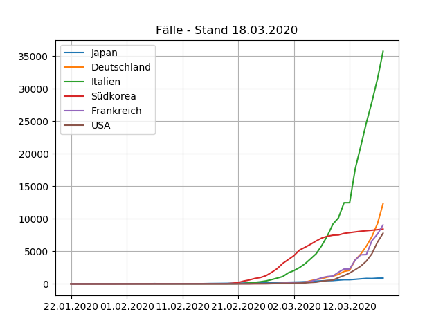
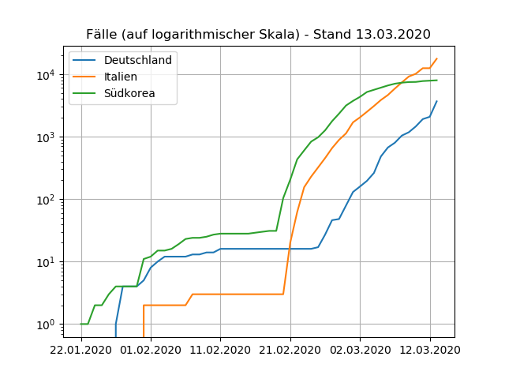

# covid-19_deutschland
Visualisierung von Covid-19 Statistiken

## Schaubilder

## Verwendung des Quelltextes

* Download der [Daten](https://github.com/CSSEGISandData/COVID-19) mittels `git submodule init` und `git submodule update`.
* Die verwendeten Python-Bibliotheken sind in `requirements.txt` aufgelistet.
