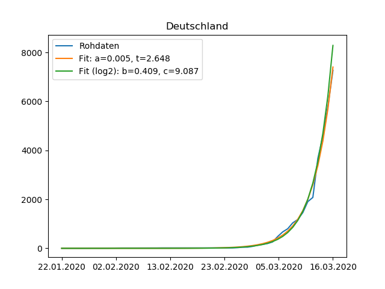
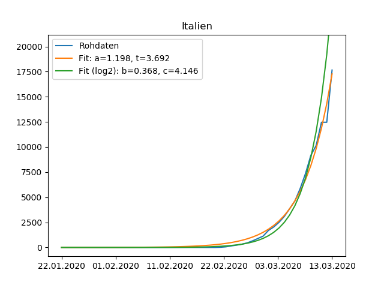
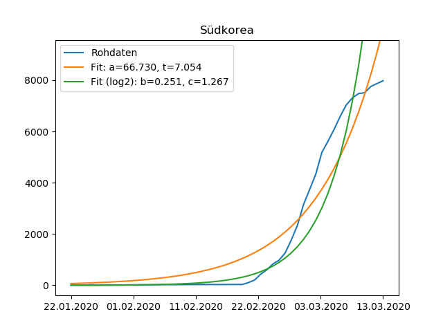
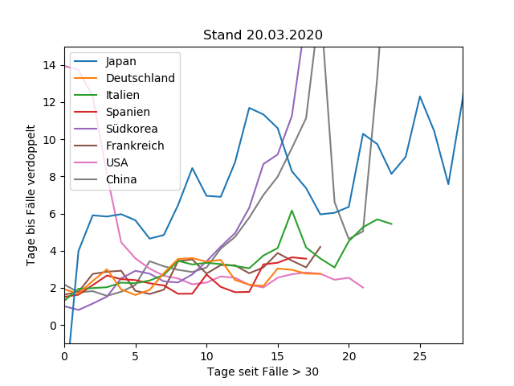

# covid-19_deutschland
Visualisierung von Covid-19 Statistiken.

## Rohdaten der Fallzahlen

 

## Fit von Exponentialfunktionen an die Rohdaten

* `Fit` von `a*2^(x/t)` an die Daten mit der Annahme, dass `exp(-inf) = 0`, d.h. keine Fälle in weiter Vergangenheit.
* `Fit (log2)` ist der Fit einer linearen Funktion `b*x+c` an `log2(Daten)`, wobei nur Datenpunkte mit Fällen > 50 verwendet werden.

  

## Zeitverlauf der vorraussichtlichen Zeit bis sich die Fallzahlen verdoppeln

* Für jeden Datenpunkt wird eine lineare Funktion (siehe oben) an `log2(Daten)` gefittet, wobei Daten die aktuellsten 3 Datenpunkte für diesen Zeitpunkt sind. Der Parameter `t=1/b` ergibt dann die aktuell prognostizierte Zeitdauer (unter Annahme einer Exponentialfunktionen) bis sich die Fallzahlen verdopplen.

## Verwendung des Quelltextes

* Download der [Daten](https://github.com/CSSEGISandData/COVID-19) mittels `git submodule init` und `git submodule update`.
* Die verwendeten Python-Bibliotheken sind in `requirements.txt` aufgelistet.
